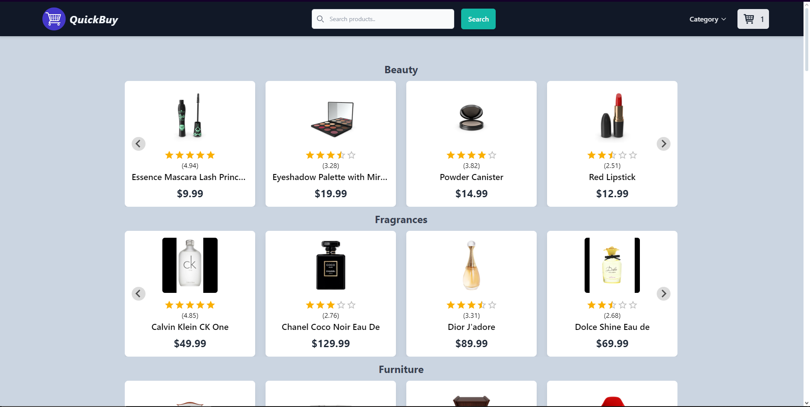
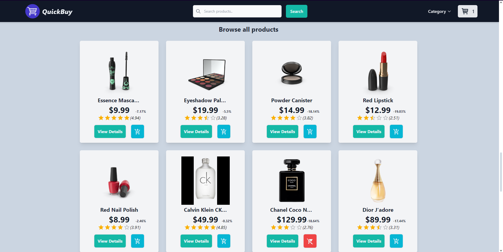
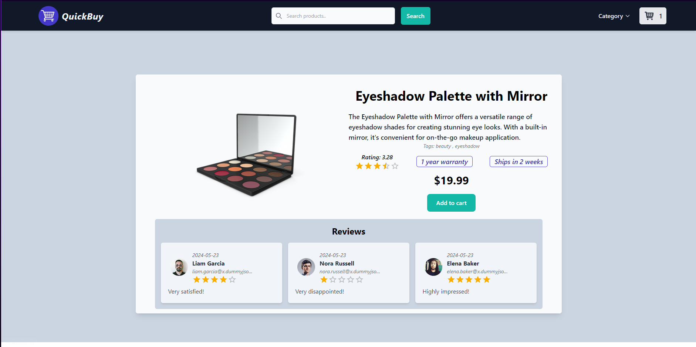
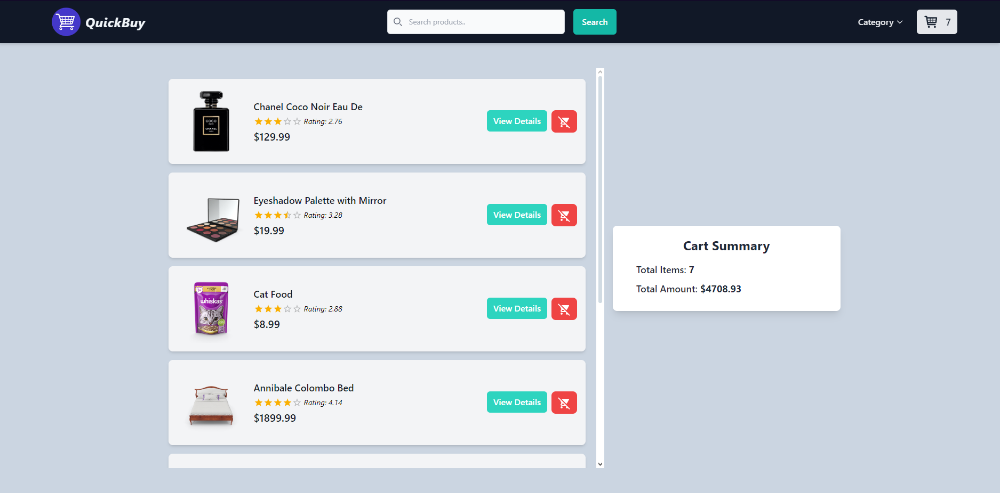
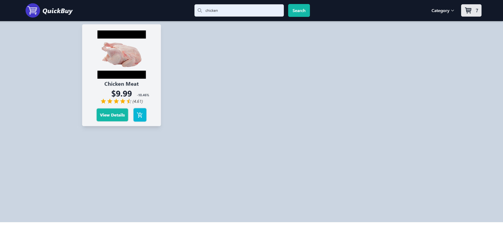

# E-Commerce Website

## Overview

An e-commerce website built with React, Tailwind CSS, and Redux for state management. This app allows users to browse products, search for items, view details, and manage a shopping cart. The website is fully responsive.

## Features

- **Home Page:** Displays products from various categories.
- **Category Browse:** Filter products by category.
- **Product Details:** View detailed information, ratings, prices, and add/remove items from the cart.
- **Search:** Find products by name.
- **Cart:** Manage cart items and view the total price.

## Tech Stack

- **Frontend:** React, Tailwind CSS, Framer Motion, React Splide, Material UI, Headless UI
- **State Management:** Redux
- **API:** DummyJSON for product data

## Usage

- **Home Page:** Explore all products or filter by category.
- **Product Details:** Click on a product to see detailed information and manage cart actions.
- **Search:** Use the search bar to find specific products.
- **Cart:** Access the Cart page to view and manage items, and see the total amount.

## Images

## GIF

